# Three Tier Web App on AWS ECS Fargate

A beginner friendly, production style deployment of a three tier web app on AWS. The infrastructure is written in Terraform, the app runs on ECS Fargate behind an Application Load Balancer with HTTPS, and every push to `main` is deployed automatically with GitHub Actions.

📖 **Full walkthrough on Hashnode:** [How I Deployed a Three Tier App on AWS ECS Fargate](https://dmlops.hashnode.dev/how-i-deployed-a-three-tier-app-on-aws-ecs-fargate-with-an-alb-acm-rds-terraform-and-github-actions)

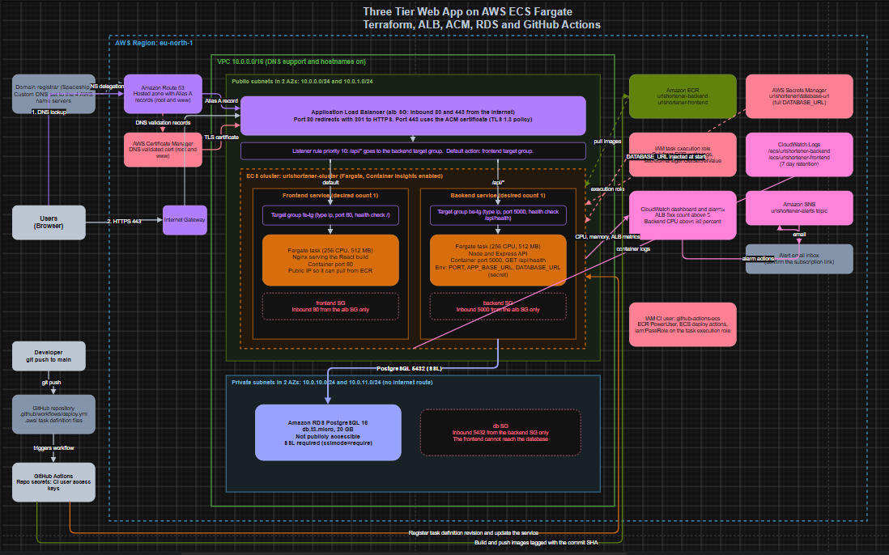

---

## Project Overview

This project started as a simple web app running on a single EC2 server with Docker Compose. It worked, but I was still patching the server, managing SSH keys and keeping a `.env` file safe.

So I rebuilt it on ECS Fargate. There are no servers to manage, no SSH, and HTTPS is handled by AWS. The whole environment can be created with Terraform and destroyed again when you are done practising.

Here is the idea in one line: **internet → ALB → Fargate tasks → RDS database**.

The Fargate tasks sit in public subnets with a public IP, which lets them pull images from ECR without paying for a NAT Gateway. Their security groups only accept traffic from the load balancer, so nobody can reach them directly. The database lives in private subnets and only trusts the backend security group.

### What changed compared to the EC2 version

| EC2 version | This version |
|---|---|
| EC2 server with Docker Compose | ECS Fargate services |
| Caddy handles HTTPS | ALB and ACM handle HTTPS |
| Elastic IP | ALB DNS name and a Route 53 Alias record |
| SSH deploy from GitHub | ECS deploy action, no SSH at all |
| `.env` file on the server | Secret stored in AWS Secrets Manager |

---

## Technologies Used

| Layer | Tools |
|---|---|
| Frontend | React, served by Nginx |
| Backend | Node.js and Express |
| Database | PostgreSQL on Amazon RDS |
| Containers | Docker, Amazon ECR |
| Compute | Amazon ECS on Fargate |
| Networking and DNS | VPC, Application Load Balancer, Route 53 |
| Security | AWS Certificate Manager, Secrets Manager, IAM, security groups |
| Monitoring | CloudWatch (dashboard, alarms, Container Insights), SNS email alerts |
| Infrastructure as code | Terraform (AWS provider `~> 5.0`) |
| CI/CD | GitHub Actions |

---

## Project Structure

The project is split into two folders on purpose. One holds the application, the other holds the infrastructure. Keeping them apart keeps things clean.

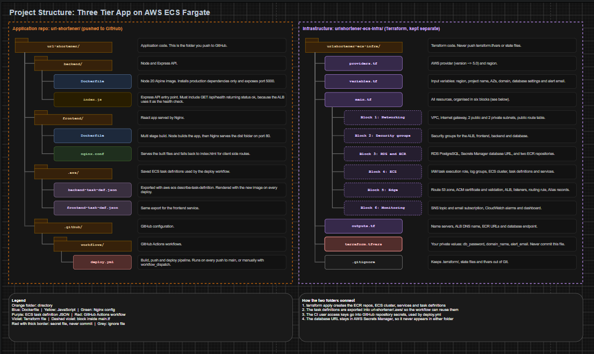


### What lives inside main.tf

| Block | What it creates |
|---|---|
| 1. Networking | VPC, internet gateway, two public and two private subnets, route table |
| 2. Security groups | ALB, frontend, backend and database groups, each trusting only the one before it |
| 3. Data and registry | RDS PostgreSQL, the database URL secret, two ECR repositories |
| 4. Compute | IAM task execution role, log groups, ECS cluster, task definitions, services |
| 5. Edge | Route 53 zone, ACM certificate with DNS validation, ALB, listeners, routing rule, Alias records |
| 6. Monitoring | SNS topic and email subscription, CloudWatch alarms and dashboard |

---

## Main Features

**HTTPS by default.** The ALB redirects all HTTP traffic to HTTPS using a 301, and the certificate comes from ACM, so there is nothing to renew by hand.

**Path based routing.** Requests to `/api/*` go to the backend. Everything else goes to the frontend. Both are served from the same domain, so the frontend simply calls relative paths like `/api/...`.

**A private database.** RDS is not publicly accessible and only accepts connections from the backend security group.

**No plain text secrets.** The database URL is stored in AWS Secrets Manager and injected into the backend container at startup. GitHub never sees it.

**Zero downtime deployments.** ECS replaces old tasks only after the new ones pass the ALB health check at `/api/health`.

**Automated CI/CD.** Each push to `main` builds both images, tags them with the commit SHA, pushes them to ECR and rolls them out to ECS. No SSH needed.

**Built in monitoring.** A CloudWatch dashboard shows CPU, memory and request counts, and alarms email you if the ALB returns too many 5xx errors or the backend CPU stays above 80 percent.

**Terraform safe deployments.** The services use `ignore_changes = [task_definition]`, so Terraform never rolls your app back to `:latest` after GitHub Actions has deployed a new version.

---

## Setup Instructions

### Prerequisites

You will need an AWS account, the AWS CLI configured, Terraform, Git Bash (or any shell), Docker Desktop, a GitHub account and a domain name.

Check your tools:

```bash
aws sts get-caller-identity
terraform -version
docker --version
```

### 1. Configure your variables

Inside the Terraform folder, create `terraform.tfvars` with your own values:

```hcl
db_password = "YOUR_DB_PASSWORD"
domain_name = "yourdomain.com"
alert_email = "you@example.com"
```

Stick to letters and numbers in the password so the connection string never breaks on special characters. Make sure `terraform.tfvars` is listed in `.gitignore`.

### 2. Provision in stages

Why stages? ACM cannot validate your certificate until your registrar uses Route 53, and ECS cannot start tasks until ECR contains images.

**Stage 1: the DNS zone and ECR only**

```bash
terraform init
terraform fmt
terraform validate

terraform apply \
  -target=aws_route53_zone.primary \
  -target=aws_ecr_repository.backend \
  -target=aws_ecr_repository.frontend
```

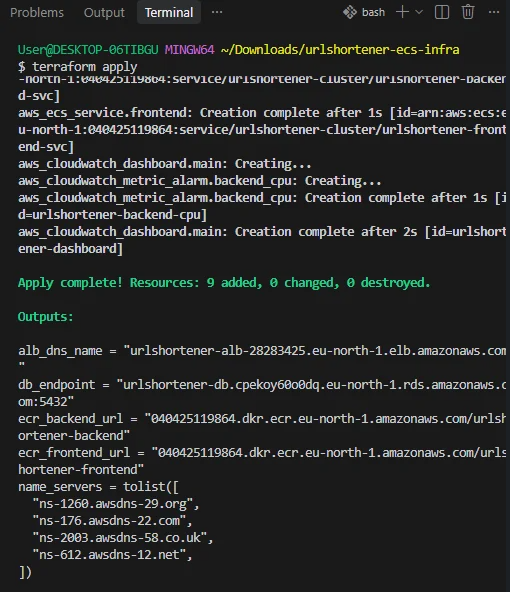

**Stage 2: point your registrar at Route 53**

Print your name servers:

```bash
terraform output name_servers
```

Then open your domain provider, go to the nameserver settings, choose Custom DNS and enter all four AWS name servers. Propagation can take a few minutes or a few hours.

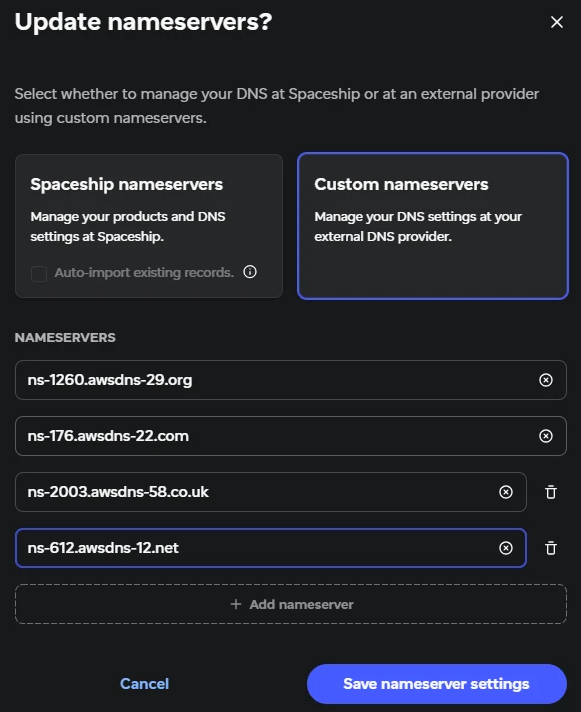

**Stage 3: push the first images by hand**

```bash
ACCOUNT=$(aws sts get-caller-identity --query Account --output text)
REGISTRY=$ACCOUNT.dkr.ecr.eu-north-1.amazonaws.com

aws ecr get-login-password --region eu-north-1 | docker login --username AWS --password-stdin $REGISTRY

docker info

docker build -t $REGISTRY/urlshortener-backend:latest ./backend
docker push $REGISTRY/urlshortener-backend:latest

docker build -t $REGISTRY/urlshortener-frontend:latest ./frontend
docker push $REGISTRY/urlshortener-frontend:latest
```

**Stage 4: apply everything**

```bash
terraform plan
terraform apply
```

This step waits for the ACM certificate until your name server change has propagated. That is normal. It times out after about 75 minutes, and you can simply run it again.

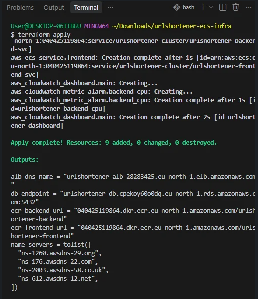

After the apply, open the confirmation email from AWS and click the link. If you skip this, your alarm emails will never arrive.

### 3. Create the CI user for GitHub Actions

1. In the AWS Console, go to IAM, then Users, then Create user (for example `github-actions-ecs`).
2. Attach the managed policy `AmazonEC2ContainerRegistryPowerUser`.
3. Add this inline policy, replacing `YOUR_ACCOUNT_ID`:

```json
{
  "Version": "2012-10-17",
  "Statement": [
    {
      "Effect": "Allow",
      "Action": [
        "ecs:RegisterTaskDefinition",
        "ecs:DescribeTaskDefinition",
        "ecs:DescribeServices",
        "ecs:UpdateService"
      ],
      "Resource": "*"
    },
    {
      "Effect": "Allow",
      "Action": "iam:PassRole",
      "Resource": "arn:aws:iam::YOUR_ACCOUNT_ID:role/urlshortener-task-exec-role"
    }
  ]
}
```

```bash
aws iam put-user-policy \
  --user-name github-actions-ecs \
  --policy-name ecs-deployment-policy \
  --policy-document file://policy.json

aws iam list-user-policies --user-name github-actions-ecs
```

4. Create an access key for the user (Security credentials, Create access key, CLI) and copy both values straight away.

> **Keep these keys private.** Never commit them, paste them into a post or share them in a screenshot. If one is ever exposed, delete it in IAM and create a new one.

### 4. Export the task definitions

The workflow needs a saved copy of each task definition. Run this from the app folder:

```bash
mkdir -p .aws

aws ecs describe-task-definition --task-definition urlshortener-backend \
  --region eu-north-1 --query taskDefinition --output json > .aws/backend-task-def.json

aws ecs describe-task-definition --task-definition urlshortener-frontend \
  --region eu-north-1 --query taskDefinition --output json > .aws/frontend-task-def.json
```

Check that each file starts with `{`. If a file is empty, the Terraform apply has not finished yet.

### 5. Push to GitHub and add secrets

```bash
git init
git add .
git commit -m "Initial commit"
git branch -M main
git remote add origin https://github.com/dml-ops/aws-ecs-fargate-terraform.git
git push -u origin main
```

In the repo, go to Settings, then Secrets and variables, then Actions, and add two repository secrets:

| Secret | Value |
|---|---|
| `AWS_ACCESS_KEY_ID` | The access key ID of your CI user |
| `AWS_SECRET_ACCESS_KEY` | The matching secret access key |

There is no database secret here. It lives in AWS Secrets Manager.

---

## Workflow Usage Guide

### Deploying a change

Commit your code and push to `main`:

```bash
git add .
git commit -m "Describe your change"
git push origin main
```

You can also run the workflow manually from the Actions tab, since `workflow_dispatch` is enabled.

### What the pipeline does

1. Checks out the code and configures AWS credentials.
2. Logs in to ECR.
3. Builds the backend and frontend images and tags them with the commit SHA.
4. Pushes both images to ECR.
5. Renders the saved task definition with the new image.
6. Registers a new task definition revision and updates the ECS service.
7. Waits for the service to become stable before moving on.

ECS only swaps in the new tasks once they pass the ALB health check, so a broken build will not take your site down.

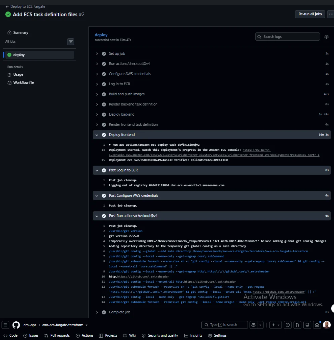

### Verifying the deployment

Check the redirect from HTTP to HTTPS. You should see a 301:

```bash
curl -I http://yourdomain.com
```

Check the backend health route. You should see a 200 and `{"status":"ok"}`:

```bash
curl -i https://yourdomain.com/api/health
```

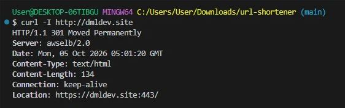

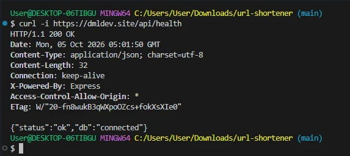

Then open your domain in the browser and try the app.

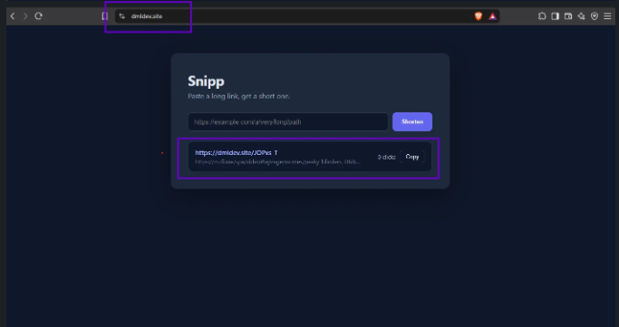

Next, check each AWS service:

| Where | What to look for |
|---|---|
| EC2, then Target Groups | Both targets show as healthy |
| ECS, then Clusters, then your cluster | Both services show 1/1 running, and Container Insights shows metrics |
| CloudWatch, then Dashboards | Your dashboard shows CPU, memory and request data |
| Your inbox | The SNS subscription is confirmed |

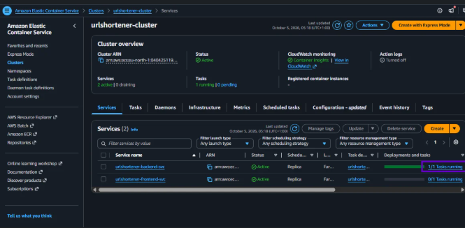

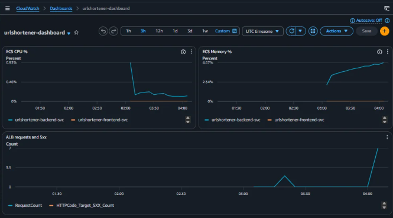

---

## Troubleshooting

These are the real problems I ran into while building this, and how I fixed them.

**ECR repositories already exist.** Terraform failed with `RepositoryAlreadyExistsException` because the repos had been created earlier with the AWS CLI. I deleted them with `aws ecr delete-repository --force` and ran Stage 1 again. The alternative is `terraform import`, which keeps the existing repos and their images.

**Resources already exist during the full apply.** The Secrets Manager secret, IAM role and CloudWatch log groups existed in AWS but not in Terraform state, probably left over from an interrupted apply. I brought them back with `terraform import`. On Git Bash, put `MSYS_NO_PATHCONV=1` in front of the log group imports so the paths are not rewritten.

**Deploy failed because the task definition files were missing.** The workflow expects `.aws/backend-task-def.json` and `.aws/frontend-task-def.json` in the repo. Export them as shown in step 4 and commit them.

**Git push rejected.** I had created `deploy.yml` in the GitHub web editor, so the remote had a commit my local folder did not. Run `git pull --rebase origin main` first, then `git push origin main`.

**Database connection errors.** RDS refuses unencrypted connections. The connection string needs `?uselibpqcompat=true&sslmode=require` at the end.

---

## Cleaning Up

The load balancer, RDS instance and Fargate tasks all bill by the hour. If you built this for practice, tear it down when you are finished:

```bash
terraform destroy
```

---

## Author

Built and documented by **DML**. Read the full story, including every mistake, on [Hashnode](https://dmlops.hashnode.dev/how-i-deployed-a-three-tier-app-on-aws-ecs-fargate-with-an-alb-acm-rds-terraform-and-github-actions).
